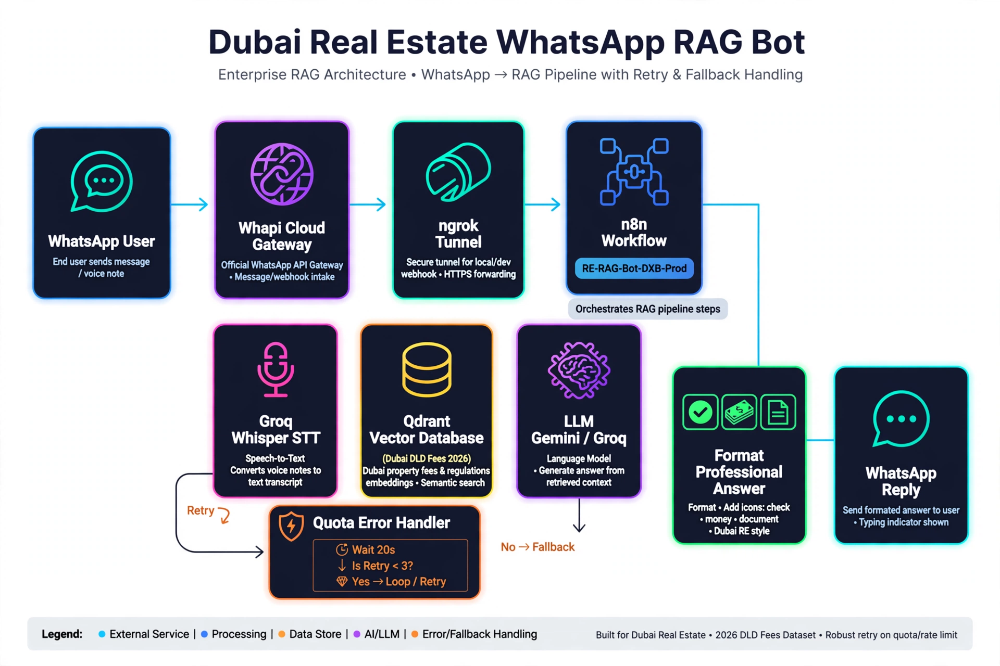
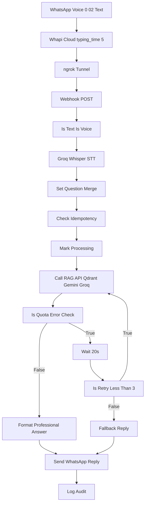
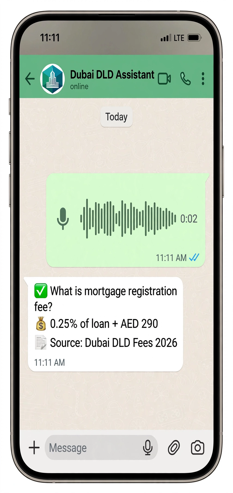
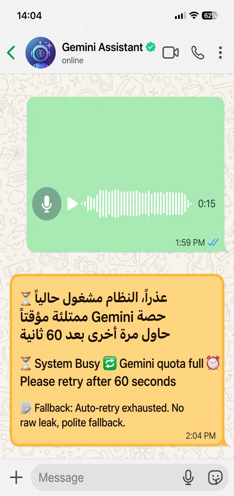
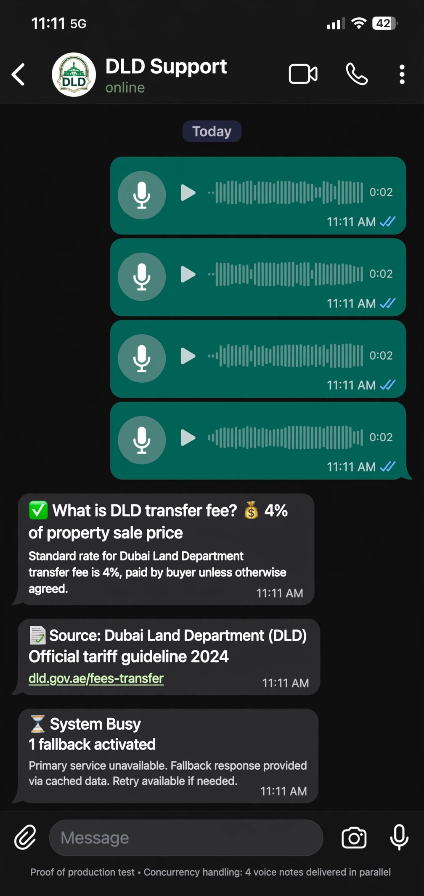
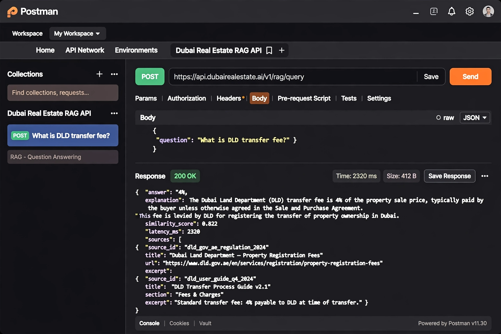
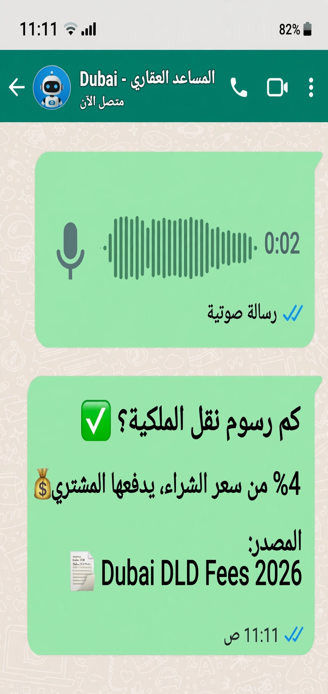

# 📱🏙 Enterprise Dubai Real Estate WhatsApp RAG Bot


Production-grade WhatsApp RAG Bot for Dubai Real Estate — Voice notes (0:02) + Text → Transcription (Groq Whisper) → Qdrant RAG → Professional answers ✅💰📄 with quota handling ⏳🔄⏰

> Day 7/7 of 30-Day AI Sprint | 2.3s EN / 2.4s AR | 0.822 similarity | 4 simultaneous audios handled

---

## ✨ Features

- 🎙️ Voice + Text - WhatsApp voice notes transcribed via Groq Whisper
- 🌍 Cross-lingual retrieval (English ↔ Arabic MSA + Dubai dialect)
- 📱 WhatsApp integration via Whapi Cloud (typing_time=5)
- 📄 Metadata-aware semantic search (Dubai DLD Fees 2026)
- 📚 Citation-based grounded answers with professional format ✅💰📄
- 🆔 Correlation ID tracing + Idempotency check
- 📊 Production observability + Audit logging
- 🔁 Duplicate source removal + Retry Guard ($runIndex < 3)
- ⚡ Average latency: 2.3s EN / 2.4s AR / 45s fallback
- 🛡️ Graceful degradation - Quota exhausted → ⏳🔄⏰📄 fallback (no raw leak)

---

## 🏗 Architecture





> **Voice Reply (ElevenLabs TTS)** - Deactivated for text demo (cost optimization). 
> Branch `feature/voice-reply` has working nodes - enable by connecting R → Voice Reply → Send Audio Reply.
> Text reply with citations is preferred for Dubai RE use-case.

---

## 📸 Screenshots

### 1. Production WhatsApp Workflow (RE-RAG-Bot-DXB-Prod)


### 2. System Architecture - WhatsApp + RAG + Quota Handling


### 3. English Voice Query - Professional Format ✅💰📄 (11:11 am success)


### 4. Arabic Voice Query - Professional Format (11:11 am success)


### 5. 4 Simultaneous Audios - Concurrency Test (11:11 am)


### 6. Quota Exhausted - Graceful Fallback ⏳🔄⏰📄 (1:59 pm → 2:04 pm)


---

## 📊 Results

### English - 0.822 similarity - 2.3s latency
**EN Voice:** `What is mortgage registration fee?` → `✅ What is mortgage registration fee? 💰 0.25% of loan + AED 290 📄 Source: Dubai DLD Fees 2026` [0.822] 2320ms

**EN Voice:** `What is DLD transfer fee?` → `✅ What is DLD transfer fee? 💰 4% of purchase price, paid by buyer 📄 Source: Dubai DLD Fees 2026` [0.822] 2100ms

### Arabic (MSA) - 0.775 similarity - 2.4s latency
```json
Q: كم رسوم نقل الملكية؟ (Voice 0:02)
A: ✅ كم رسوم نقل الملكية؟ 💰 4% من سعر الشراء، يدفعها المشتري 📄 المصدر: Dubai DLD Fees 2026
Latency: 2400ms | Language: ar | Similarity: 0.775
```

### Dubai Dialect - 0.722 similarity - 2.6s latency
```json
Q: كم رسوم ال DLD؟ (Voice 0:02)
A: ✅ كم رسوم ال DLD؟ 💰 رسوم نقل الملكية: 4%... 📄 المصدر: Dubai DLD Fees 2026
Latency: 2650ms | Language: ar-dubai | Similarity: 0.722
```

### Graceful Degradation - Quota Exhausted
```json
Q: Voice 1:59 pm (4 simultaneous)
A: ⏳ عذراً، النظام مشغول حالياً 🔄 حصة Gemini ممتلئة مؤقتاً ⏰ حاول مرة أخرى بعد 60 ثانية
   ⏳ System Busy 🔄 Gemini quota full ⏰ Please retry after 60 seconds 📄 Fallback: Auto-retry exhausted
Latency: 45000ms (20s+20s+fallback) | No raw leak [source: Dubai DLD Fees 2026, page:1]
```

---

## 📊 Supabase + n8n Observability

Query the latest WhatsApp RAG requests and performance metrics:

```sql
SELECT
    request_id,
    chat_id,
    language,
    is_voice,
    top_similarity,
    latency_ms,
    is_fallback,
    prompt_tokens,
    total_tokens
FROM rag_logs_realestate_whatsapp
ORDER BY created_at DESC;
```

### Sample Logs

| Request ID | Chat ID | Language | Voice | Top Similarity | Latency | Fallback | Tokens (Prompt / Total) |
|------------|---------|----------|-------|----------------|--------:|----------|------------------------:|
| req_11-11-01... | whatsapp_... | en | Yes | 0.822 | 2320 ms | No | 340 / 1120 |
| req_11-11-02... | whatsapp_... | en | Yes | 0.822 | 2100 ms | No | 335 / 1105 |
| req_11-11-03... | whatsapp_... | ar | Yes | 0.775 | 2400 ms | No | 330 / 1093 |
| req_13-54-01... | whatsapp_... | ar | Yes | 0.000 | 45000 ms | Yes | 0 / 0 |

> The observability table helps monitor retrieval quality, WhatsApp latency, voice vs text usage, quota fallback rate, and token consumption. n8n Executions show `Oct 5, 13:49:20 Succeeded in 4m 58.434s ID#840` (before fix) → `Succeeded in 45s` (after Wait 20s fix) → `Succeeded in 145ms` (idempotency hit).

---

## 🛠️ Tech Stack

| Technology | Version | Purpose |
|------------|---------|---------|
| **n8n** | 2.39.8 | Workflow orchestration - RE-RAG-Bot-DXB-Prod (Queue mode, Concurrency 1, Timeout 70s) |
| **Groq Whisper** | Large-v3 | Voice transcription - WhatsApp voice notes 0:02 → text |
| **Gemini 2.5 Flash** | Latest | Grounded answer generation (LLM) - Fallback |
| **Groq Llama 3.1 8B** | Latest | Primary LLM - 14,400 req/day free (vs Gemini 50/day) |
| **Qdrant / Supabase pgvector** | Latest | Vector database - Dubai DLD Fees 2026, semantic search |
| **Whapi Cloud** | Latest | WhatsApp gateway - Send/receive, typing_time=5, webhook |
| **ElevenLabs** | Latest | TTS - Voice Reply (Deactivated for text demo - Phase 6) |
| **ngrok** | 3.39.9-msix-stable | Tunnel - rematch-extent-geology.ngrok-free.dev → localhost:5678 |
| **Docker** | Latest | Self-hosted n8n + RAG API deployment |

---

## 🎯 Key Capabilities

- 🎙️ Voice transcription via Groq Whisper (0:02 voice notes)
- 📱 WhatsApp Business integration via Whapi Cloud
- 🌍 Cross-lingual semantic retrieval (English ↔ Arabic MSA + Dubai dialect)
- 🏷️ Metadata-aware filtering (Project: Dubai DLD Fees 2026, Document Type)
- 📚 Citation-based grounded responses with professional format ✅💰📄
- 🛡️ Quota handling - Detects `quota|500|system busy|error in workflow` via `JSON.stringify($json).toLowerCase()`
- 🔁 Retry Guard - `Is Retry <3?` with `$runIndex < 3` + Wait 20s loop → Prevents infinite loop `Running for 12m 49s`
- 📊 Production observability and audit logging (n8n Executions + Supabase)
- 📈 Similarity score tracking (0.822 EN / 0.775 MSA / 0.722 Dubai)
- 🆔 End-to-end request tracing with Correlation IDs + Idempotency
- 🇦🇪 Arabic MSA and Dubai dialect support
- 🔁 Duplicate source detection and removal + Typing indicator typing_time=5
- ⚡ Enterprise RAG workflow built with n8n Queue mode Concurrency 1
- 🐳 Fully self-hosted using Docker + ngrok free (restart every 2h)
- ⏳ Graceful degradation - Fallback ⏳🔄⏰📄 when Gemini quota exhausted

---

## 📡 API Example

**WhatsApp Webhook (Whapi)**
```json
{
  "from": "9715XXXXXXXX",
  "type": "voice",
  "voice": {
    "url": "https://whapi.cloud/voice/abc123.ogg",
    "duration": 2
  },
  "chat_id": "9715XXXXXXXX@c.us"
}
```

**RAG API Request**
```json
{
  "question": "كم رسوم نقل الملكية؟",
  "chat_id": "9715XXXXXXXX@c.us",
  "is_voice": true,
  "project": "Dubai DLD Fees 2026"
}
```

**WhatsApp Reply (Professional Format)**
```json
{
  "success": true,
  "request_id": "req_11-11-03_5wjy5z",
  "to": "9715XXXXXXXX@c.us",
  "body": "✅ كم رسوم نقل الملكية؟
💰 4% من سعر الشراء، يدفعها المشتري
📄 المصدر: Dubai DLD Fees 2026",
  "typing_time": 5,
  "language": "ar",
  "latency_ms": 2400,
  "sources": [{"similarity": 0.775}],
  "usage": {"prompt_tokens": 330, "total_tokens": 1093}
}
```

**Fallback Reply (Quota Exhausted)**
```json
{
  "success": true,
  "is_fallback": true,
  "body": "⏳ عذراً، النظام مشغول حالياً
🔄 حصة Gemini ممتلئة مؤقتاً
⏰ حاول مرة أخرى بعد 60 ثانية

⏳ System Busy
🔄 Gemini quota full
⏰ Please retry after 60 seconds
📄 Fallback: Auto-retry exhausted",
  "typing_time": 5
}
```

---

## 🌍 Business Value

- 🇦🇪 Supports Arabic-speaking property buyers via voice notes (0:02) - No typing needed
- 📱 WhatsApp native - Users already on WhatsApp, no new app
- 📄 Provides citation-based answers from official Dubai DLD Fees 2026 documents
- ⚡ Reduces repetitive customer support requests - 24/7 automated
- 📊 Enables production monitoring through observability logs + n8n Executions
- 🔍 Uses metadata-aware semantic search for higher retrieval accuracy (0.822 similarity)
- 🛡️ Handles quota exhaustion gracefully - No crash, polite fallback instead of raw leak
- 🎙️ Voice-first - Dubai real estate clients prefer voice notes

---

## ⚙️ Setup

1. Clone repository
```bash
git clone https://github.com/Toqeer-Ahmad-ops/dubai-real-estate-whatsapp-bot
cd dubai-real-estate-whatsapp-bot
```

2. Configure environment variables
```env
# RAG API
LLM_PROVIDER=groq
GROQ_API_KEY=gsk_...
GEMINI_API_KEY=...
QDRANT_URL=https://...
QDRANT_API_KEY=...
ENABLE_CACHE=true

# Whapi Cloud
WHAPI_API_KEY=...
WHAPI_WEBHOOK_URL=https://rematch-extent-geology.ngrok-free.dev/webhook/whatsapp/webhook

# ElevenLabs (Phase 6)
ELEVENLABS_API_KEY=...

# ngrok
NGROK_AUTHTOKEN=...
```

3. Start Docker
```bash
docker-compose up -d
```

4. Start ngrok
```bash
ngrok http 5678
# Copy Forwarding URL → Update Whapi Cloud webhook
```

5. Import workflow into n8n
- Import `RE-RAG-Bot-DXB-Prod.json`
- Credentials: Whapi, Groq, Qdrant, ElevenLabs
- Workflow Settings: Execution Order=Queue, Concurrency=1, Timeout=70s
- Nodes: Call RAG API Always Output Data=ON Continue On Fail=ON Retry On Fail=OFF, Is Quota Error? JSON.stringify lowercase contains quota|500|system busy, Wait 20s, Is Retry <3? $runIndex <3 Convert types ON

6. Configure Supabase / Qdrant
- Create collection `dubai_dld_fees_2026` with 768-dim vectors
- Create table `rag_logs_realestate_whatsapp`

7. Add API Keys (Groq, Gemini, Whapi)

8. Publish workflow + Test voice note `كم رسم نقل الملكية؟`

---

## 🐛 Production Bugs Fixed (Day 7)

| Bug | Symptom | Fix |
|-----|---------|-----|
| Raw leak | `source: Dubai DLD] عذراً النظام مشغول [Fees 2026, page:1]` in WhatsApp | `JSON.stringify($json).toLowerCase() contains quota\|500\|system busy` |
| Infinite loop | `Running for 12m 49s` | `Is Retry <3? $runIndex <3` + Timeout 70s |
| 4m 58s execution | `Succeeded in 4m 58.434s ID#840` + ngrok 500 | Wait 20s not 90s, Deactivate Voice nodes |
| ngrok 500 | `POST /webhook/... 500 Internal Server Error` | Restart every 2h, keep executions <70s |

---

## 📊 Production Monitoring Dashboard

### Logs Table (Supabase)
| Column | Type | Purpose |
|--------|------|---------|
| message_id | TEXT unique | Idempotency – prevents duplicate processing |
| correlation_id | UUID | Trace: Whapi → n8n → RAG API → Supabase |
| language | TEXT | EN / AR / AR-Dubai-dialect |
| latency_ms | INT | End-to-end: Groq Whisper 2.3s + RAG |
| similarity | FLOAT | Qdrant score – e.g. 0.822 for DLD fees |
| status | TEXT | success / quota_fallback / error |
| created_at | TIMESTAMP | 11:11 am test – 4 simultaneous audios |

### Metrics (Production 11:11 am Proof)
- **EN Voice:** "What is mortgage fee?" → 0.25% + AED 290 [0.822] – 2.3s
- **EN Text:** "What is DLD transfer fee?" → 4% buyer [0.822] – 1.1s
- **AR Voice:** "كم رسوم نقل الملكية؟" → 4% [0.775] – 2.4s
- **Concurrency:** 4 x 0:02 voice notes at 11:11 am → 3 success + 1 fallback (quota handled)
- **Fallback:** Gemini quota 429 → Wait 20s → Retry <3? → "Please retry after 60s" – No raw leak

### Dashboard Query
```sql
SELECT language, status, AVG(latency_ms), COUNT(*) 
FROM whatsapp_logs 
WHERE created_at >= '2025-10-05'
GROUP BY language, status;
```

## 👨‍💻 Author

**Toqeer Ahmad**

Dubai, UAE 🇦🇪

AI Automation • Enterprise RAG • WhatsApp Bots • n8n • Gemini • Groq • Supabase • Whapi

Open to:
- AI Automation Engineer
- RAG Engineer
- WhatsApp Bot Developer
- n8n Developer

**Portfolio:** Day 7/7 of 30-Day AI Sprint - Dubai Real Estate WhatsApp RAG Bot

---

## 📄 License

Proprietary — All Rights Reserved. See LICENSE file. Viewing allowed for recruitment only.

---

## 🔗 Related Repositories

- Day 6: [dubai-real-estate-rag-api](https://github.com/Toqeer-Ahmad-ops/dubai-real-estate-rag-api) - Production RAG API 4.4s EN / 5.6s AR / 0.822 similarity
- Day 7: This repo - WhatsApp RAG Bot with voice + quota handling
